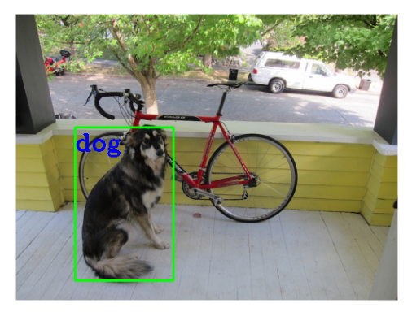

 

**Object Detection using YOLOv3 and OpenCV**

 

## Description

This project implements an object detection system using the YOLOv3 (You Only Look Once) deep learning model and OpenCV. It can identify a specific target object and localize multiple objects in an image, highlighting them with bounding boxes and labels. The system is useful for tasks such as surveillance, autonomous driving, and general image analysis.

 

## Features

* Load pre-trained YOLOv3 model (`yolov3.weights` and `yolov3.cfg`)
* Recognize 80 common objects from the COCO dataset
* Visualize detections with bounding boxes and confidence scores
* Customize detection by selecting a specific target object
 

---

##  Installation

```bash
pip install opencv-python matplotlib numpy
```

Download the following files and place them in the project folder:

* [`yolov3.weights`](https://sourceforge.net/projects/yolov3.mirror/)
* [`yolov3.cfg`](https://github.com/pjreddie/darknet/blob/master/cfg/yolov3.cfg)
* [`coco.names`](https://github.com/pjreddie/darknet/blob/master/data/coco.names)

---

##  Usage

1. Clone the repository and open the notebook.
2. Update the paths to the model files and your input image.
3. Run the notebook.

 

##  Example Output



---

##  Project Structure

```
├── yolov3.cfg
├── yolov3.weights
├── coco.names
├── object_detection.ipynb
└── README.md
```

---

##  Model

* **YOLOv3:** Fast, real-time object detection model trained on the COCO dataset.
* **Frameworks:** OpenCV, NumPy, Matplotlib

  
